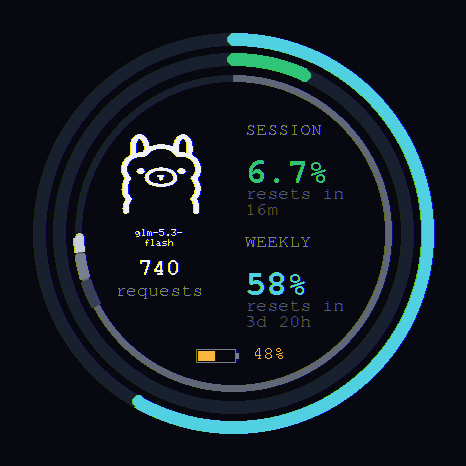

# Ollama Usage Meter for M5Stack StopWatch

Your Ollama limits, at a glance, on a gorgeous round AMOLED watch —
**ollama.com cloud usage** (session + weekly) and **local server activity**
live on your desk.



Three rings, zero chrome:
- **Outer ring (cyan)** — weekly usage %, big number matches
- **Middle ring (green/amber/red)** — session usage %, big number matches
  (green <70% · amber 70–90% · red ≥90%)
- **Thin inner ring** — reset timer: fills as your session window elapses;
  the comet head marks "now" and completes exactly at reset
- **Center** — top model, today's requests, battery level

## Requirements

- **M5Stack StopWatch** (ESP32-S3, round 466×466 AMOLED)
- A computer on the same WiFi that runs: **Python 3** + your browser session
  logged into [ollama.com](https://ollama.com) (that's where the usage data lives)
- Local Ollama server optional — cloud usage alone works fine

## How it works

```
[M5Stack StopWatch] --WiFi--> [companion.py on your computer :8615]
                                 ├─ scrapes ollama.com/settings usage
                                 │   (cookie auth — see Setup step 2)
                                 ├─ polls local Ollama /api/ps + /api/tags
                                 └─ tails ~/.ollama/logs/server.log
```

The watch is a dumb renderer; your computer does the scraping (a browser
session cookie can't live on an ESP32). One small Python script, stdlib-only.

The watch finds the companion automatically — the computer **broadcasts a UDP
beacon** every 3 seconds that the watch listens for (works even on mesh
routers where mDNS doesn't cross networks).

## Setup

### 1. Run the companion on your computer

```bash
git clone https://github.com/styles01/m5stack-ollama-meter.git
cd m5stack-ollama-meter/companion
METER_COOKIES_JSON=/path/to/ollama-cookies.json python3 companion.py
```

The companion:
- serves the device on `http://<your-ip>:8615` (TCP) and broadcasts the
  discovery beacon on UDP `8616`
- tails your local Ollama server (optional; works without it)

Firewall note: allow incoming **TCP 8615** and **UDP 8616** on your computer.

### 2. Connect your ollama.com account

Create an **API key** (once, takes 30 seconds — it never expires):
1. Go to [ollama.com/settings/keys](https://ollama.com/settings/keys) → create key
2. Hand it to the companion, either way works:
   ```bash
   OLLAMA_API_KEY=your_key python3 companion.py        # env var
   # or:  echo "your_key" > ollama-api-key.txt          # file next to the script
   ```

That's it — the companion polls the official `ollama.com/api/usage` endpoint
with your key: session/weekly limits, per-model request counts, computed reset
countdowns. No cookies, no scraping, no expiry.

<details>
<summary>Alternative: browser session cookie (legacy fallback)</summary>

If you'd rather not create a key, the companion can scrape
[ollama.com/settings](https://ollama.com/settings) with your browser session
cookie: DevTools (⌥⌘J) → Application → Cookies → copy `__Secure-session`,
save as `ollama-cookies.json` (`[{"name": "__Secure-session", "value": "PASTE_HERE"}]`),
run with `METER_COOKIES_JSON=./ollama-cookies.json`. Cookies expire — expect
to re-copy them.
</details>

Keys/cookies live on your computer only. The watch never sees them.

### 3. Flash the firmware

**Option A — M5Burner (easiest):**
1. Open M5Burner → **ESPTool**
2. Grab [`ollama-meter.ino.merged.bin` from Releases](https://github.com/styles01/m5stack-ollama-meter/releases/latest)
3. Write at offset **`0x0`** with dio / 80m / detect (the defaults)

**Option B — esptool directly:**
```bash
esptool --chip esp32s3 -p /dev/cu.usbmodemXXXX -b 460800 \
  write_flash --flash_mode dio --flash_size 16MB --flash_freq 80m 0x0 \
  ollama-meter.ino.merged.bin
```

**Building from source:**
```bash
arduino-cli core update-index --additional-urls https://espressif.github.io/arduino-esp32/package_esp32_index.json
arduino-cli core install esp32:esp32
arduino-cli lib install M5Unified M5GFX

cd firmware/ollama-meter
arduino-cli compile --fqbn "esp32:esp32:esp32s3:PartitionScheme=huge_app,PSRAM=opi,FlashSize=16M,USBMode=hwcdc,CDCOnBoot=cdc" --build-path .build .
```

### 4. Configure WiFi from your phone (no cables needed)

First boot: the watch becomes its own access point and shows setup on screen.
1. Join **`M5Meter-XXXX`** on your phone (it pops the setup page, or open `http://192.168.4.1`)
2. Pick your WiFi from the list (**what the watch can actually see**), type the password
3. Companion host: leave blank — the watch finds your computer via the UDP beacon
4. Save. The watch reboots onto your WiFi and starts rendering live data.

**Updating the firmware later:** flash the app only, preserving your WiFi:

```bash
esptool --chip esp32s3 -p /dev/cu.usbmodemXXXX -b 460800 \
  write_flash --flash_mode dio 0x10000 .build/ollama-meter.ino.bin
```

(A full `merged.bin` flash at 0x0 is a factory reset — it wipes saved WiFi.)

**Buttons:**
- **A** (click) — flip between the meter face and the system page
- **A** (hold 2 s) — re-open WiFi setup
- **B** — cycle screen brightness
- **C** — power button (hardware; never used by the app)

## Troubleshooting

**Watch says "connecting..." forever** — the companion isn't reachable. Check
it's running (`curl http://<computer-ip>:8615/api/health`) and that both
devices are on the same WiFi.

**Cloud rings show `--`** — no API key configured (Setup step 2) or the key
was revoked. Create/refresh the key; local stats keep working meanwhile.

**Setup page won't load** — forget the `M5Meter-XXXX` network on your phone,
rejoin, and manually open `http://192.168.4.1`. If your computer runs a
firewall, allow TCP 8615 / UDP 8616.

**Black screen after flashing** — the PSRAM flag is missing. Use the exact
FQBN from "Building from source" (`PSRAM=opi` is mandatory on this panel).

**Wrong model name / no model** — the model comes from the ollama.com usage
bars; it appears after the first successful cloud fetch.

## FAQ

**Does this send my data anywhere?** No. Everything is local network: watch ↔
your computer ↔ ollama.com with your cookie. No cloud, no telemetry.

**Why a companion?** ollama.com usage is only in a logged-in HTML page; TLS +
session cookies can't run on the ESP32. A small Python script on the computer
you already run Ollama on solves it.

**Token counts?** Not available — ollama.com exposes only usage percentages
and per-model request counts. (A logging proxy is a possible future feature.)

**Windows/Linux?** The beacon-based discovery is pure Python sockets — works
everywhere. Firmware builds on any OS with arduino-cli. On Linux/Windows,
point `METER_OLLAMA_LOG` at your server log if you want the local-activity
stats (macOS default path is `~/.ollama/logs/server.log`).

**Provisioning security?** The setup AP is open and unauthenticated — standard
for captive portals, but don't run setup in a hostile space.

## License

MIT for this repo. Built on [m5stack-claude-meter](https://github.com/s-iwaki-d/m5stack-claude-meter) (CC0) —
the ring/canvas/burn-in-protection patterns come from there. Ollama logo via
[LobeHub icons](https://lobehub.com/icons/ollama).

## Credits

- [s-iwaki-d/m5stack-claude-meter](https://github.com/s-iwaki-d/m5stack-claude-meter) — the reference this adapts
- [M5StopWatch-UserDemo](https://github.com/m5stack/M5StopWatch-UserDemo) — captive-portal provisioning pattern (MIT)
- M5Stack for the gorgeous hardware