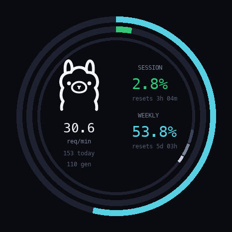

# Ollama Usage Meter for M5Stack StopWatch

A desk companion for people who run Ollama: a real **watch face** on the
M5Stack StopWatch (round 466×466 AMOLED) showing your **ollama.com cloud
usage** (session + weekly limits) and **local server activity** (req/min,
24h trend) at a glance.



Three rings, zero chrome:
- **Outer ring (cyan)** — weekly usage %, big number matches
- **Middle ring (green/amber/red)** — session usage %, big number matches (green <70%, amber 70–90%, red ≥90%)
- **Thin inner ring** — reset timer: it fills as your session window elapses;
  the comet head marks "now" and completes exactly at reset
- Center: live req/min, today's requests/generations, both reset countdowns

## How it works

```
[M5Stack StopWatch] --WiFi--> [companion.py on your computer :8615]
                                 ├─ scrapes ollama.com/settings usage
                                 │   (cookie auth — see Setup step 2)
                                 ├─ polls local Ollama /api/ps + /api/tags
                                 └─ tails ~/.ollama/logs/server.log
```

The watch is a dumb renderer; your computer does the scraping (a browser
session cookie can't live on an ESP32). One small Python script, stdlib-only.

## Setup

### 1. Run the companion on your computer

Requires Python 3 (macOS/Linux have it). Save your ollama.com session cookie
to a file (see *Getting the cookie* below), then:

```bash
git clone https://github.com/styles01/m5stack-ollama-meter.git
cd m5stack-ollama-meter/companion
METER_COOKIES_JSON=/path/to/ollama-cookies.json python3 companion.py
```

The companion:
- serves the device on `http://<your-ip>:8615`
- **broadcasts a UDP beacon** (`OLLAMA-METER <ip> <port>` on port 8616) every
  3 seconds — the watch auto-discovers your computer, even across mesh APs
  where mDNS fails (also advertises `ollama-meter.local` via mDNS as a bonus)
- tails your local Ollama server (optional; works without it)

### 2. Getting the cookie

The ollama.com usage dashboard has no public API. The companion reads your
logged-in session cookie:

1. Log into [ollama.com/settings](https://ollama.com/settings) in Chrome
2. DevTools (⌥⌘J) → Application → Cookies → `https://ollama.com`
3. Copy the value of the `__Secure-session` cookie
4. Create `ollama-cookies.json`:

```json
[{"name": "__Secure-session", "value": "PASTE_HERE"}]
```

The cookie lives on your computer only. The watch never sees it.
Cookie expired? The device shows stale/unavailable cloud data; re-copy it.

### 3. Build + flash the firmware

Install [arduino-cli](https://docs.arduino.cc/arduino-cli/), then:

```bash
arduino-cli core update-index --additional-urls https://espressif.github.io/arduino-esp32/package_esp32_index.json
arduino-cli core install esp32:esp32
arduino-cli lib install M5Unified M5GFX

cd firmware/ollama-meter
arduino-cli compile --fqbn "esp32:esp32:esp32s3:PartitionScheme=huge_app,PSRAM=opi,FlashSize=16M,USBMode=hwcdc,CDCOnBoot=cdc" --build-path .build .
```

Flash the resulting `ollama-meter.ino.merged.bin` to the watch at offset `0x0`
(esptool, or M5Burner → ESPTool):

```bash
esptool --chip esp32s3 -p /dev/cu.usbmodemXXXX -b 460800 \
  write_flash --flash_mode dio --flash_size 16MB --flash_freq 80m 0x0 \
  .build/ollama-meter.ino.merged.bin
```

### 4. Configure WiFi from your phone (no cables needed)

First boot: the watch becomes its own access point and shows setup on screen.
1. Join **`M5Meter-XXXX`** on your phone (it pops the setup page, or open `http://192.168.4.1`)
2. Pick your WiFi from the list (**what the watch can actually see**), type the password
3. Companion host: leave blank — the watch finds your computer via the UDP beacon
4. Save. The watch reboots onto your WiFi and starts rendering live data.

Change networks later: hold **BtnC** while booting.

**Updating the firmware later:** flash the app only, preserving your WiFi:

```bash
esptool --chip esp32s3 -p /dev/cu.usbmodemXXXX -b 460800 \
  write_flash --flash_mode dio 0x10000 .build/ollama-meter.ino.bin
```

(A full `merged.bin` flash at 0x0 is a factory reset — it wipes saved WiFi.)

**Buttons:** A = force refresh · B = brightness · C = (hold at boot) setup

## FAQ

**Does this send my data anywhere?** No. Everything is local network: watch ↔
your computer ↔ ollama.com with your cookie. No cloud, no telemetry.

**Why a companion?** ollama.com usage is only in a logged-in HTML page; TLS +
session cookies can't run on the ESP32. A 200-line Python script on the
computer you already run Ollama on solves it.

**Windows/Linux?** Companion works anywhere Python runs (mDNS uses
`dns-sd`-equivalents; see script header). Firmware builds on any OS with
arduino-cli.

## License

MIT for this repo. Built on [m5stack-claude-meter](https://github.com/s-iwaki-d/m5stack-claude-meter) (CC0) —
the ring/canvas/burn-in-protection patterns come from there. Ollama logo via
[LobeHub icons](https://lobehub.com/icons/ollama).

## Credits

- [s-iwaki-d/m5stack-claude-meter](https://github.com/s-iwaki-d/m5stack-claude-meter) — the reference this adapts
- [M5StopWatch-UserDemo](https://github.com/m5stack/M5StopWatch-UserDemo) — captive-portal provisioning pattern (MIT)
- M5Stack for the gorgeous hardware